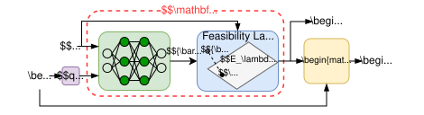
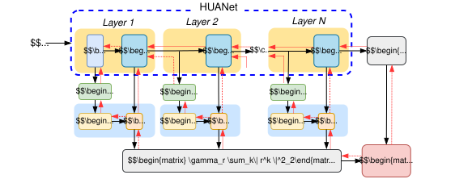

# HUANet: Hard-Constrained Unrolled ADMM for Constrained Convex Optimization

HUANet is a learning-to-optimize architecture that unrolls the Alternating Direction Method of Multipliers (ADMM) and embeds hard-constrained neural networks into its iterations.

> **TL;DR:** HUANet combines the structure of ADMM with trainable neural updates. A differentiable correction stage enforces equality constraints by construction, while first-order optimality conditions guide training. The repository includes quadratic programming, entropy optimization, and energy-management model predictive control experiments.

[Paper](https://arxiv.org/abs/2604.13179) | [Installation](#installation) | [Quick start](#quick-start) | [Experiments](#experiments) | [Citation](#citation)

## Overview

End-to-end optimization proxies can be fast, but their outputs may violate constraints and they often discard useful algorithmic structure. HUANet addresses these limitations by:

- unrolling ADMM into a fixed-depth, trainable architecture
- inserting a neural correction into each unrolled iteration
- enforcing equality constraints through a differentiable correction stage
- including first-order optimality conditions as soft training constraints

The implementation is evaluated on constrained quadratic programs, entropy-based optimization problems, and an energy-management model predictive control problem.

## Architecture

HUANet combines the iterative structure of ADMM with HardNet, a hard-constrained neural network. Each HUANet layer uses HardNet to replace ADMM's expensive primal optimization step, then applies the standard auxiliary and dual updates. The resulting state is passed to the next layer, and the same learned components are shared across all layers.

[](HardNet.svg)

[](HUANet.svg)

## Installation

HUANet requires Python 3.10 or newer. Clone the repository and install it in an isolated environment:

```bash
git clone https://github.com/nxt-lab/huanet.git
cd huanet

python3 -m venv .venv
source .venv/bin/activate
python3 -m pip install --upgrade pip
python3 -m pip install -e .
```

The project uses JAX/Flax. JAX accelerator support depends on the platform-specific JAX installation; consult the [JAX installation guide](https://docs.jax.dev/en/latest/installation.html) when configuring a GPU.

## Quick start

Each experiment follows the same generate, train, and evaluate workflow. To run the quadratic-programming example from the repository root:

```bash
python3 examples/qp/generate.py
python3 examples/qp/train.py
python3 examples/qp/main.py
```

Experiment settings are defined in `examples/qp/cfg.yaml`. The main groups control:

| Group | Configuration |
| --- | --- |
| `problem` | Problem setups |
| `data` | Dataset paths and data splits |
| `neural_net` | Network architecture and training mode |
| `optimizer` | Optimizer and learning rate |
| `training` | Batch size, epochs, and unrolled ADMM depth |
| `admm` | ADMM configurations |

Training produces model checkpoints, loss histories, and evaluation metrics for feasibility, optimality, and runtime.

## Experiments

The repository contains three experiment families:

| Problem | Directory | Description |
| --- | --- | --- |
| Quadratic programming | `examples/qp/` | Parametric constrained quadratic programs |
| Entropy maximization | `examples/entropy/` | Entropy-based constrained optimization |
| Energy management | `examples/energy/` | MPC with renewable generation and battery storage |

To run a different experiment, replace `qp` in the quick-start commands with `entropy` or `energy`:

```bash
python3 examples/energy/generate.py
python3 examples/energy/train.py
python3 examples/energy/main.py
```

The generated datasets and trained models are organized by problem size and experiment configuration. Result directories contain the configuration, training log, checkpoints, losses, and evaluation outputs associated with a run.

### Metrics

- **Constraint violation:** the magnitude of equality and inequality constraint violations.
- **Optimality:** the objective value relative to a reference solver solution.
- **Runtime:** HUANet inference time compared with optimization baselines.

### Visualization

Benchmark plots can be regenerated from the repository root:

```bash
python3 results/benchmark/plot_admm.py
python3 results/benchmark/plot_energy.py
python3 results/benchmark/plot_time.py
```

The plotting scripts write their figures to the project media directory.

## Repository layout

```text
.
├── src/
│   ├── huanet/          # HUANet model, neural layers, and utilities
│   ├── admm/            # ADMM baseline
│   └── dc3/             # DC3 baseline
├── examples/
│   ├── qp/              # Quadratic-programming experiment
│   ├── entropy/         # Entropy experiment
│   └── energy/          # Energy-management MPC experiment
├── data/                # Generated and source datasets
└── results/
    ├── benchmark/       # Benchmark plotting scripts
    └── media/           # README and result figures
```

The core HUANet implementation is in `src/huanet/huanet.py`, with neural components in `src/huanet/neural_layer.py` and shared routines in `src/huanet/utils.py`.

## Citation

If you use HUANet in your research, please cite:

```bibtex
@article{tran2026huanet,
  title   = {HUANet: Hard-Constrained Unrolled ADMM for Constrained Convex Optimization},
  author  = {Tran, Trinh and Nguyen, Binh and Nghiem, Truong X},
  journal = {arXiv preprint arXiv:2604.13179},
  year    = {2026}
}
```
